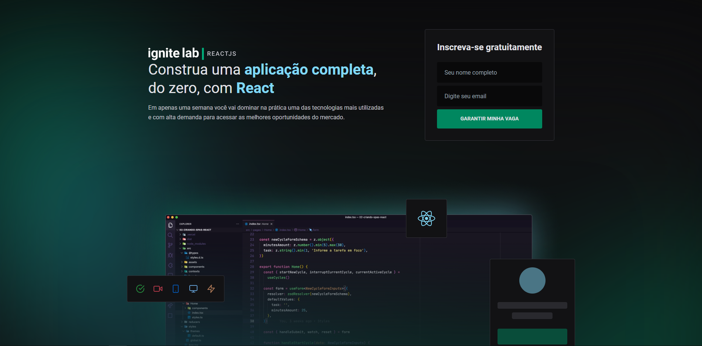
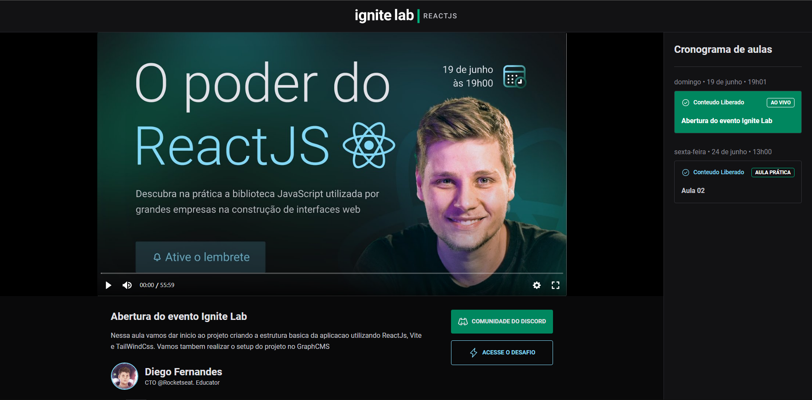
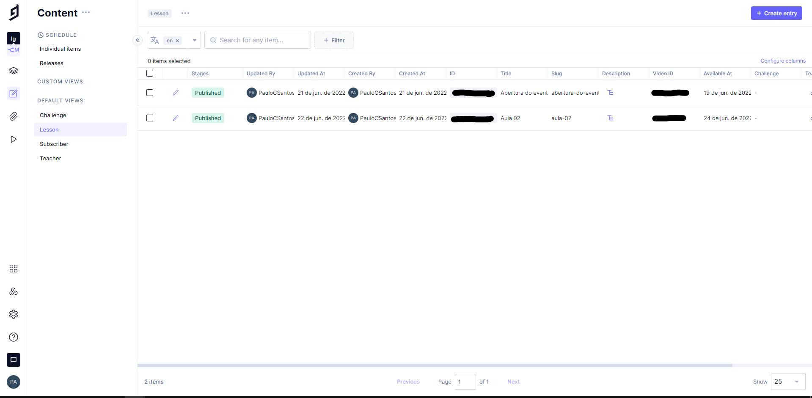

# EVENT PLATFORM

# Sobre o projeto

Aplicação web para uma plataforma de eventos.

### Explicação do sistema

- Na página inicial é mostrado informações do evento que vai ser realizado  

- Também tem um formulário para cadastro no evento

- Na página do evento é mostrado o nome do evento, a aula e as informações sobre a aula

- Também é mostrado o cronograma de aulas, o tipo da aula e se a aula está liberada 

### Tela inicial


### Tela evento


### GraphsCMS views


### GraphsCMS new entry


# 🚀 Começando

Essas instruções permitirão que você obtenha uma cópia do projeto em operação na sua máquina local para fins de desenvolvimento e teste.

## 📋 Pré-requisitos

- npm / yarn
- Cadastro no GraphCMS

## 🔧 Instalação
### :warning::warning: **A pasta imgs**: é para guardar as imagens usadas no readme.md! Apagar ela depois do clone :warning::warning:

``` bash
## clonar repositório
git clone https://github.com/PauloCSantos/event-platform.git

## entrar na pasta do projeto no terminal
cd event-platform

## instalar as dependencias
npm i

## configurar o o Graphql
npm run codegen

## executar o projeto
npm run dev

## Schema
os schemas devem ser criado no GraphCMS(consultar a documentação para auxilio)
```

## 🛠️ Construído com

- Vite
- React
- TypeScript
- TailWindCss
- Phosphor Icons
- Graphql
- GraphCMS
- Graphql-codegen

## ✒️ Autor

* **Paulo C Santos** - [Linkedin](https://www.linkedin.com/in/paulocsantos1995/)

## 🖐️ Agradecimento

Agradeço a RocketSeat, a especialização react foi um evento com muita novidade e tecnlogia.

- Link da RocketSeat: https://www.rocketseat.com.br/
